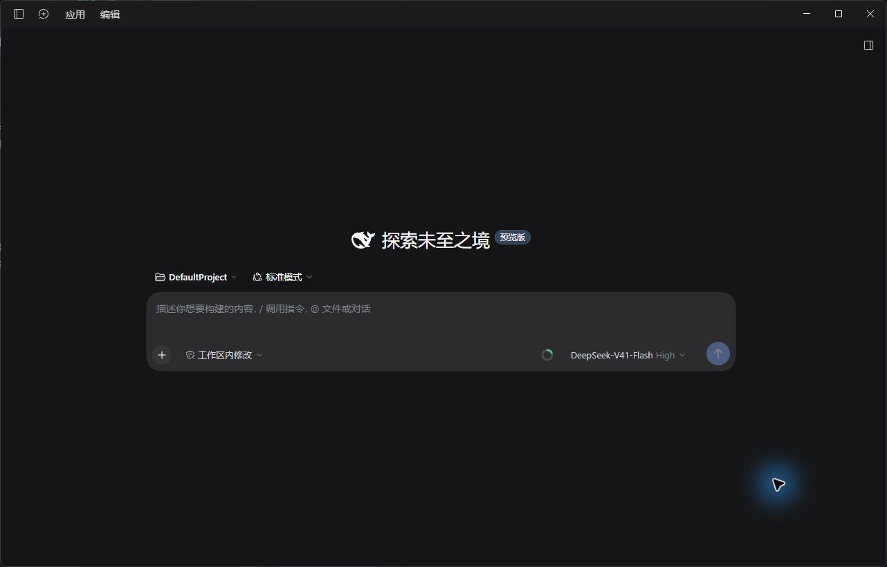
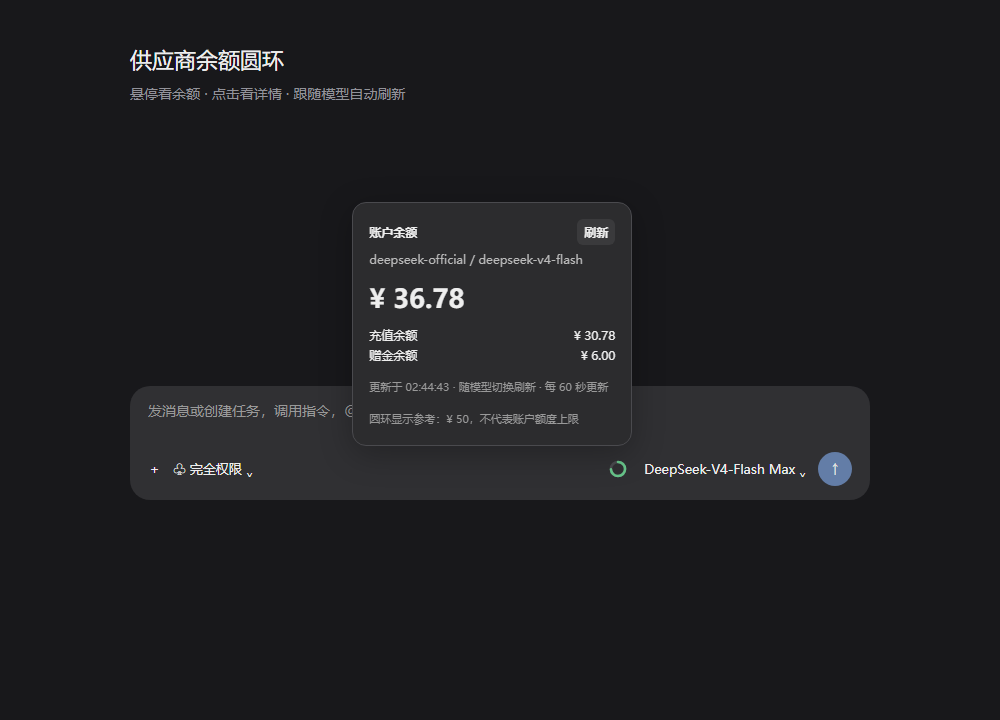
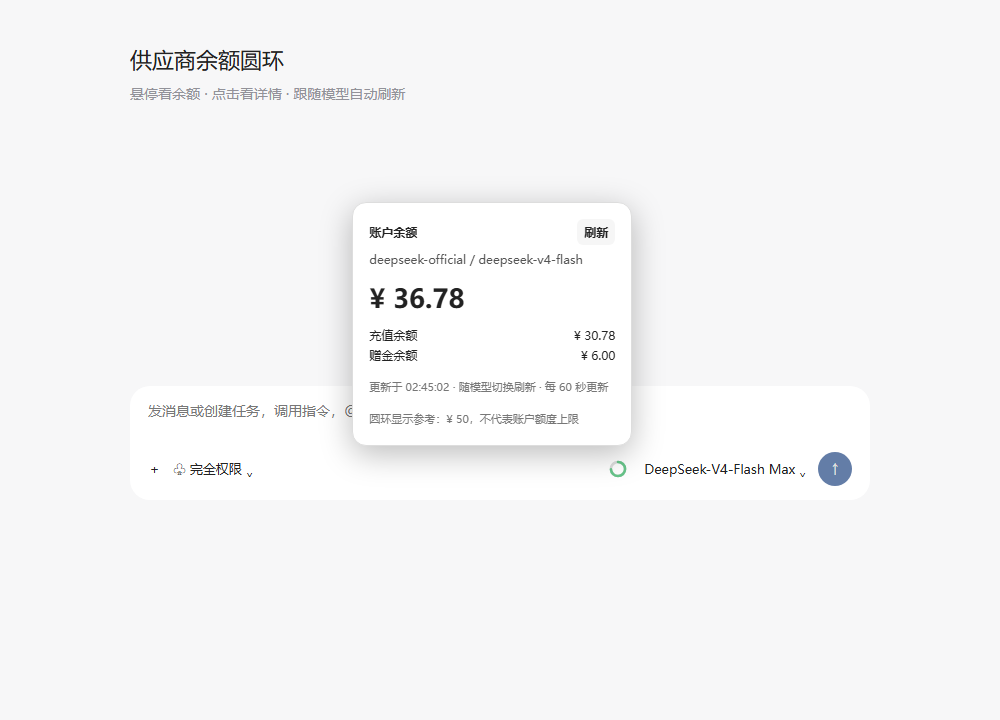

# dsh-balance-chip

[简体中文](README.md) | English

[](https://github.com/O1dZ/dsh-balance-chip/actions/workflows/ci.yml) [](LICENSE)

A provider balance ring in the DeepSeek Harness composer toolbar. Hover to see the balance, click for details, and switch models to refresh automatically. Balances refresh every 60 seconds.

## Screenshots

Actual Harness window, with the balance ring to the left of the model selector:



Dark theme details (simulated data):



Light theme details (simulated data):



The first image is an actual application screenshot with the sidebar collapsed and real balance details closed. The two detail images use simulated amounts. No test output or real account data is included. The plugin UI currently follows the implementation's Chinese labels.

## Features

- Persistent bundle installation: the plugin loads at startup without recreating a dynamic script.
- Per-conversation provider and model tracking, immediate refresh on model changes, and manual refresh.
- Balance breakdowns, currency labels and timestamps, with theme-aware tooltips and opaque detail panels.
- Portal-based panels avoid composer clipping. Escape or an outside click closes the panel.
- Late responses cannot overwrite a newly selected provider. Refresh failures retain the last value for the same provider and mark it stale.
- Missing credentials, denied permissions, timeouts, unsupported interfaces and malformed responses never appear as a zero balance.

## Compatibility and providers

Targets the public service contracts in **Harness 0.2.0-rc.2**, including SettingsForms.describe, modelDirectories and Typert codec factories. Framework regression tests and mock UI checks were performed for the Windows desktop version. Other Harness versions and operating systems have not been verified. Development requires Node.js 22.14+.

| Provider | Available information |
| --- | --- |
| DeepSeek API, including custom route aliases | Total, paid and bonus balances, separated by currency |
| DeepSeek Account | Existing Harness account balance and login state |
| Moonshot China / international | Available, cash and voucher balances, CNY / USD |
| SiliconFlow China / international | Total, paid and bonus balances |
| OpenRouter | Remaining API key allowance; account credits require a management key |
| Custom compatible gateways | Known DeepSeek balance, One API / New API quota and legacy dashboard billing formats |

The plugin uses the active configuration and credential reference of the selected provider. You do not enter a second API key. There is no universal balance discovery protocol: an unimplemented response format is not automatically supported. Ordinary OpenAI, Anthropic and Google model keys, and OAuth subscription quotas, are not supported by these adapters.

One API / New API quota stays in its original units; the plugin does not invent a currency conversion. The ring uses ¥50 for CNY and $10 for USD as visual reference values, **not account limits**. It does not estimate daily spend, token costs or request counts.

## Installation

This package has not been published to npm. Install the local source package into an existing Harness profile. The following PowerShell commands use the Windows desktop profile; substitute your actual profile path if different. Git and pnpm are required. Close Harness first.

1. Clone the repository from a working directory:

```powershell
git clone https://github.com/O1dZ/dsh-balance-chip.git
```

2. Stay in the directory where you ran git clone, and add the local package to the existing profile without running dependency installation scripts:

```powershell
pnpm --dir "$env:USERPROFILE\.dsh\profiles\desktop" add --ignore-scripts ("file:" + (Resolve-Path '.\dsh-balance-chip').Path.Replace('\', '/'))
```

3. Append **dsh-balance-chip** to the existing **dsh.profile.bundles** array in that profile's package.json. Preserve all existing bundles. The package's cordis.patch.yml inserts the plugin instance.
4. Start Harness, open a conversation and select a configured provider model. Fully restart Harness after initial installation or host-code updates; refreshing the web page does not replace host modules already loaded in the process.

Keep the local source directory because this installation references it. Alternative installation methods must preserve the host entry, client entry, ./typert export and bundle patch.

## Updates and removal

Update from the repository directory:

```powershell
git pull --ff-only
```

Repeat installation step 2 and fully restart Harness. To uninstall, close Harness, remove the package from the profile's dsh.profile.bundles array, then remove the dependency:

```powershell
pnpm --dir "$env:USERPROFILE\.dsh\profiles\desktop" remove --ignore-scripts dsh-balance-chip
```

## Development and tests

Development scripts use only Node.js built-in modules; no development dependencies need to be installed. Harness supplies the peer dependencies. Run each command separately from the repository directory:

```powershell
npm run check
```

```powershell
npm test
```

```powershell
npm run build
```

- check validates JavaScript syntax, generated client consistency and common private-data patterns. Automated scanning does not replace manual review.
- npm test runs 11 portable unit tests for adapters, errors, currencies, selection changes and request races.
- Ten additional framework integration tests require your own installed Harness app.asar. Set DSH_DESKTOP_ASAR to its actual absolute path locally, then run:

```powershell
npm run test:integration
```

Integration tests temporarily extract the installed framework and clean up afterward. They use mock credentials and balances, covering real Cordis, Registry/Gateway, SettingsForms and live credential-reference updates. YAML migration, expression interpolation and network transport boundaries are stubbed. The framework archive is neither uploaded nor distributed.

Open tests/render-test.html for the mock browser test; append ?light for the light theme. It loads React from esm.sh, does not connect to an account, and checks opaque backgrounds, portals, provider switching, refresh and dismissal.

CI runs on Windows and checks syntax/privacy, portable tests, build consistency and the npm package file list. Real balances and startup loading must be verified in your own Harness environment.

## Security and privacy

Balance requests execute only on the host and return normalized amounts through the existing trusted Typert channel. Keys resolve through Harness credentials. Keys, endpoint URLs and raw errors are not sent to the client. Requests use GET, remain on the configured origin and reject redirects. Plain HTTP is only accepted for local hosts.

Never include keys, session cookies, OAuth tokens, real profiles, account information or personal paths in issues, pull requests, screenshots or logs. See [SECURITY.md](SECURITY.md) for private vulnerability reporting.

## Contributing and license

Provider adapters for documented public balance APIs are welcome. Read [CONTRIBUTING.md](CONTRIBUTING.md) and the [Code of Conduct](CODE_OF_CONDUCT.md). Licensed under [MIT](LICENSE).

Ring interactions were inspired by [EdwinZDZ/dsh-api-balance-ring](https://github.com/EdwinZDZ/dsh-api-balance-ring); provider-directory and adapter ideas reference [sumomok/dsh-plugins](https://github.com/sumomok/dsh-plugins/tree/main/packages/balance). This project keeps its own implementation and does not distribute Harness framework code or real configuration. Third-party rights and licenses remain with their respective authors.
